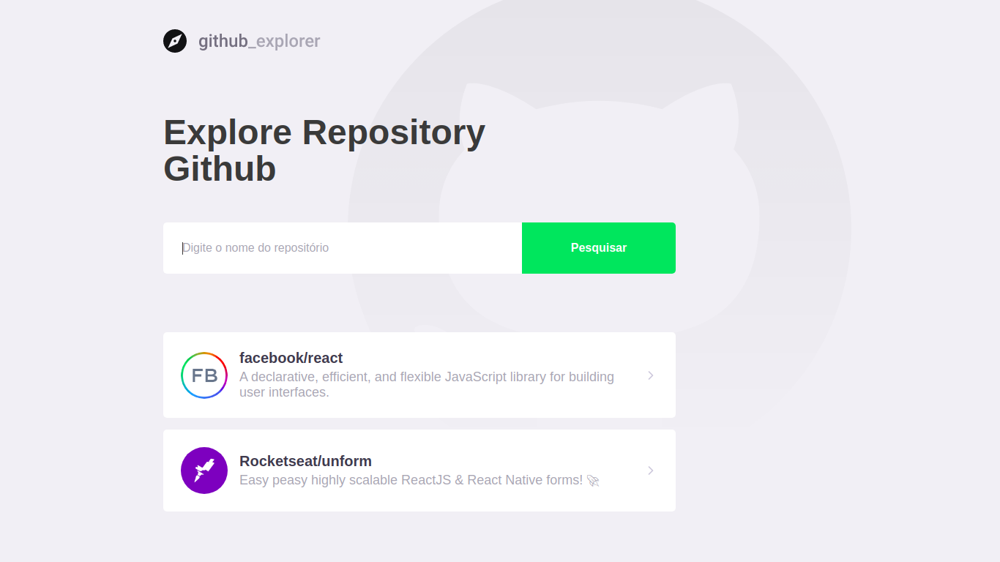

<h1 align="center">
  
</h1>

<h3 align="center">
  Github Explorer
</h3>

<blockquote align="center">“Falar é fácil, eu quero ver é o código!”</blockquote>

  <a href="#-tecnologias">Tecnologias</a>&nbsp;&nbsp;&nbsp;|&nbsp;&nbsp;&nbsp;
  <a href="#-instalação-e-execução">Instalação e execução</a>&nbsp;&nbsp;&nbsp;|&nbsp;&nbsp;&nbsp;
  <a href="#-licença">Licença</a>

 

  

## 🚀 Tecnologias

Esse projeto foi desenvolvido com as seguintes tecnologias:

- [React](https://reactjs.org)
- [Typescript](https://www.typescriptlang.org/)

## 📥 Instalação e execução

  1. Execulte `npm install` ou `yarn` para instalar as dependências;
  2. Execulte `npm run start` ou `yarn start` para iniciar o servidor de desenvolvimento;

## 📝 Licença

Esse projeto está sob a licença MIT. Veja o arquivo [LICENSE](LICENSE.md) para mais detalhes.
